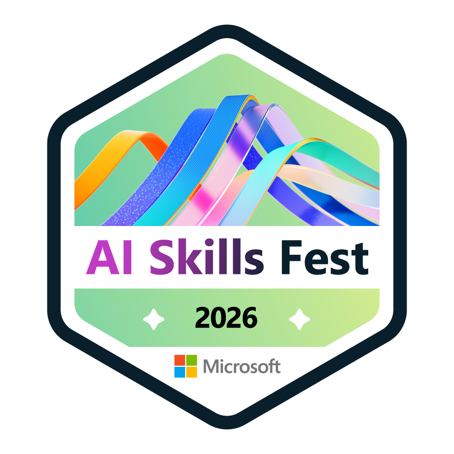

  

  

<h3 align="center">💻 Student Developer | Python Enthusiast</h3>

  🚀 Learning by building real projects  
  ♿ Interested in Accessibility, Automation, and Backend Development  
  📍 Tamil Nadu, India

  

---

## 🚀 About Me

- 🎓 Incoming Computer Science Student
- 🏆 Participated in hackathons and project challenges
- 🌱 Improving problem-solving and software development skills
- 📚 Exploring Backend Development, APIs, Open Source, and AI

---

## 🏅 Certifications & Achievements

  

  🎖️ <b>Microsoft AI Skills Fest 2026</b> 
  Official digital credential issued through Microsoft and Credly.

  

### Achievements

- 🎖️ Microsoft AI Skills Fest 2026 Badge
- 🏆 Hackathon Participant
- ♿ Creator of AccessBridge
- 💻 Multiple Personal Python Projects

---

## 🛠️ Tech Stack

  

---

## 📂 Featured Projects

### ♿ AccessBridge

Accessibility-focused desktop assistant designed to help users interact with computers using alternative input methods.

#### Features

- 🎤 Voice Commands
- 📡 Morse Code Input
- ♿ Accessibility Tools
- 🖥️ Desktop Assistance

**Tech Used:** Python

🔗 **Repository:** 
[AccessBridge]
(https://github.com/GOKULNATH20072008/AccessBridge)

---

### 🏆 Hackathon Projects

Participated in online hackathons and built practical software solutions while learning:

- Project Development
- Problem Solving
- Presentation Skills
- Team Collaboration
- Software Deployment

---

## 🎯 Current Focus

- Learning FastAPI
- Learning PostgreSQL
- Backend Development
- Data Structures & Algorithms
- Open Source Contributions
- Building Real-World Projects

---

## 🌐 Connect With Me

  

---

## 📊 GitHub Stats

  
  

---

  <b>Build → Learn → Improve → Repeat 🚀</b>

